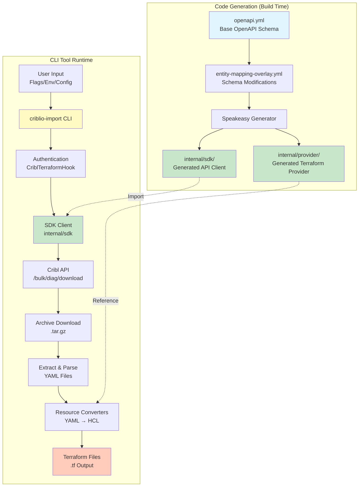
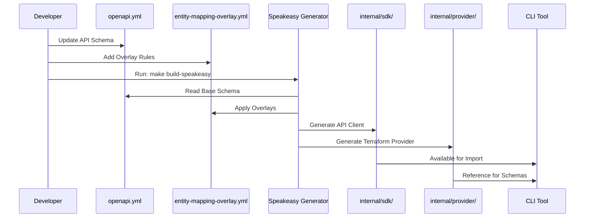
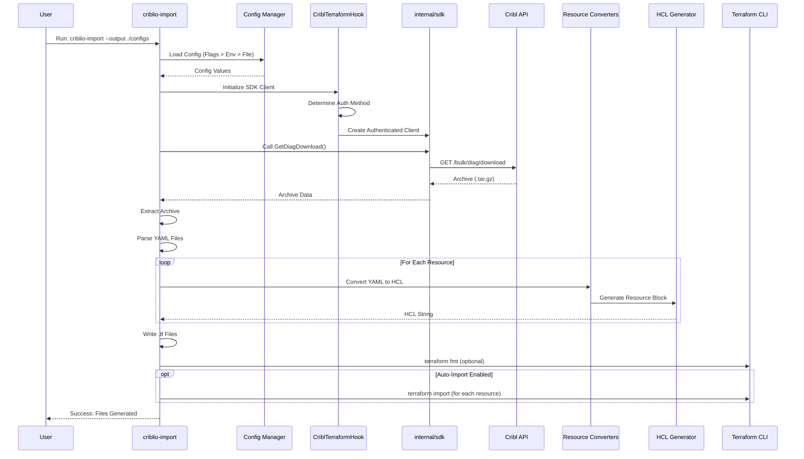
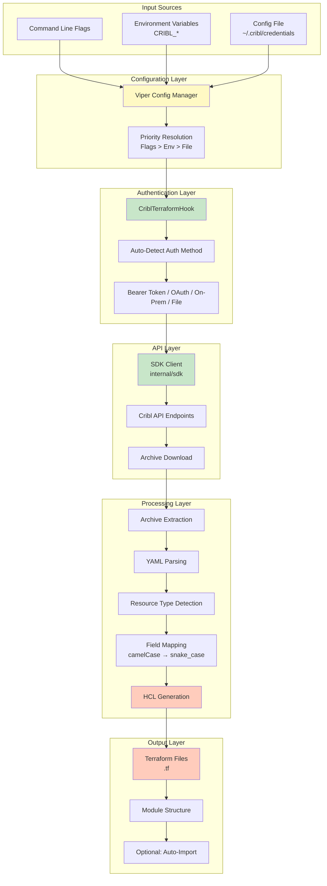
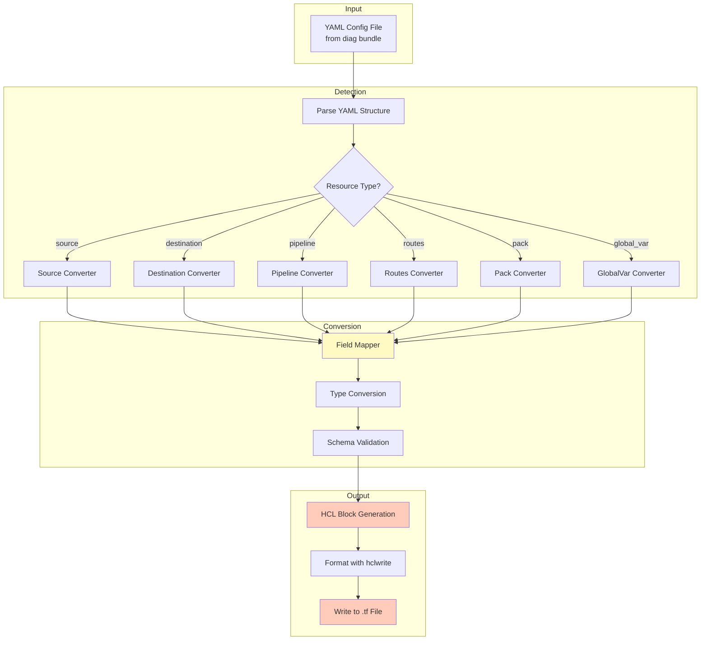
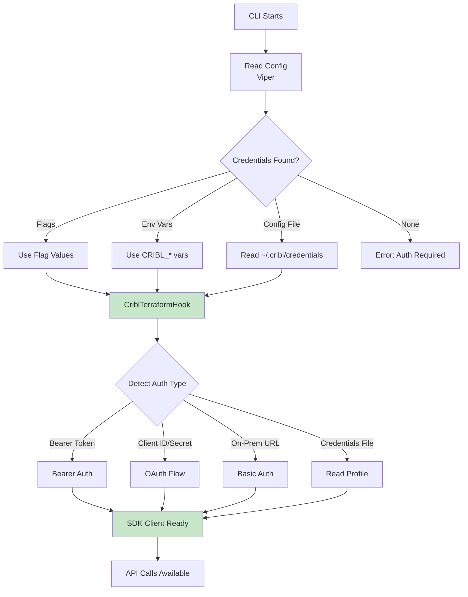
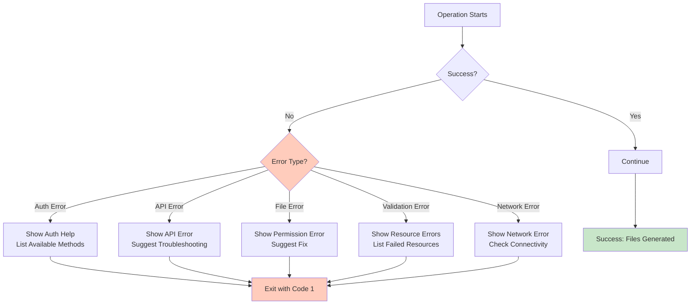

# CLI Tool Design Flow Diagram

## Overview

This document provides visual diagrams and detailed explanations of how the `criblio-import` CLI tool is designed and works.

---

## 1. High-Level Architecture Flow



---

## 2. Detailed Component Flow

```mermaid
graph LR
    subgraph "1. Initialization"
        A1[main.go<br/>Cobra CLI] --> A2[initViper<br/>Config Management]
        A2 --> A3[Load Config<br/>Flags > Env > File]
    end
    
    subgraph "2. Authentication"
        B1[Parse Auth Flags] --> B2[CriblTerraformHook<br/>Auto Auth Handler]
        B2 --> B3{Auth Method?}
        B3 -->|Bearer| B4[Bearer Token]
        B3 -->|OAuth| B5[OAuth Flow]
        B3 -->|On-Prem| B6[Username/Password]
        B3 -->|File| B7[~/.cribl/credentials]
        B4 --> B8[SDK Client Initialized]
        B5 --> B8
        B6 --> B8
        B7 --> B8
    end
    
    subgraph "3. API Interaction"
        C1[SDK Client] --> C2[Call API<br/>/bulk/diag/download]
        C2 --> C3[Download Archive<br/>.tar.gz]
        C3 --> C4[Extract Archive]
    end
    
    subgraph "4. Processing"
        D1[Parse YAML Files] --> D2[Detect Resource Type]
        D2 --> D3[Route to Converter]
        D3 --> D4[Source Converter]
        D3 --> D5[Destination Converter]
        D3 --> D6[Pipeline Converter]
        D3 --> D7[Other Converters]
        D4 --> D8[Generate HCL]
        D5 --> D8
        D6 --> D8
        D7 --> D8
    end
    
    subgraph "5. Output"
        E1[HCL Generation] --> E2[Format with<br/>terraform fmt]
        E2 --> E3[Write Files<br/>modules/ or resources/]
        E3 --> E4[Optional: Auto-Import<br/>terraform import]
    end
    
    A3 --> B1
    B8 --> C1
    C4 --> D1
    D8 --> E1
    E4 --> E5[Complete]
    
    style A1 fill:#fff9c4
    style B2 fill:#c8e6c9
    style C1 fill:#c8e6c9
    style D8 fill:#ffccbc
    style E3 fill:#ffccbc
```



---

## 3. Code Generation Flow (Build Time)



---

## 4. CLI Tool Execution Flow (Runtime)



---

## 5. Data Flow Diagram



---

## 6. Resource Conversion Flow



---

## 7. File Structure Flow

```
User runs: criblio-import --output ./terraform-configs

Input:
├── Flags: --output, --include, --bearer-token, etc.
├── Env Vars: CRIBL_BEARER_TOKEN, CRIBL_WORKSPACE_ID, etc.
└── Config: ~/.cribl/credentials.ini

Processing:
├── Viper merges config (Flags > Env > File)
├── CriblTerraformHook authenticates
├── SDK calls /bulk/diag/download
├── Archive extracted to temp directory
└── YAML files parsed and converted

Output Structure:
terraform-configs/
├── main.tf                 # Provider configuration
├── variables.tf            # Sensitive variables (optional)
├── README.md              # Generated documentation
└── modules/
    ├── sources/
    │   └── main.tf        # All source resources
    ├── destinations/
    │   └── main.tf        # All destination resources
    ├── pipelines/
    │   └── main.tf        # All pipeline resources
    ├── routes/
    │   └── main.tf        # All routes resources
    └── packs/
        └── main.tf        # All pack resources
```

---

## 8. Authentication Flow



---

## 9. Error Handling Flow



---

## 10. Integration Points

### SDK Integration
```
CLI Tool
  ↓ imports
internal/sdk
  ├── criblio.go (Main Client)
  ├── models/operations/ (API Endpoints)
  └── models/shared/ (Data Types)
```

### Provider Integration
```
CLI Tool
  ↓ references
internal/provider
  ├── *_resource.go (Schemas)
  └── *_resource_sdk.go (Type Mappings)
```

### Terraform Integration
```
CLI Tool
  ↓ generates
Terraform Files (.tf)
  ↓ imports
Terraform State
  ↓ manages
Cribl Resources
```

---

## 11. Key Design Decisions

### 1. **Code Reuse**
- ✅ Import `internal/sdk` directly
- ✅ Reuse authentication (`CriblTerraformHook`)
- ✅ Reference provider schemas for validation

### 2. **Configuration Management**
- ✅ Viper for multi-source config
- ✅ Priority: Flags > Env > File
- ✅ Supports all auth methods

### 3. **Modular Conversion**
- ✅ Separate converter per resource type
- ✅ Reusable field mapper
- ✅ Type-safe HCL generation

### 4. **Output Flexibility**
- ✅ Module structure (default)
- ✅ Flat resources (option)
- ✅ Optional auto-import

---

## 12. Example Execution Flow

### Step-by-Step Example

```bash
# 1. User runs command
criblio-import --output ./configs --include sources,destinations

# 2. Viper loads config
#    - Checks flags: output=./configs, include=sources,destinations
#    - Checks env: CRIBL_BEARER_TOKEN, CRIBL_WORKSPACE_ID
#    - Checks file: ~/.cribl/credentials

# 3. Authentication
#    - CriblTerraformHook detects: Bearer token from env
#    - Creates authenticated SDK client

# 4. API Call
#    - SDK calls: GET /bulk/diag/download
#    - Receives: archive.tar.gz

# 5. Processing
#    - Extract archive
#    - Parse YAML files
#    - Filter: only sources and destinations
#    - Convert YAML → HCL

# 6. Output
#    - Write modules/sources/main.tf
#    - Write modules/destinations/main.tf
#    - Write main.tf (provider config)

# 7. Result
#    ✅ Success: Files generated in ./configs/
```

---

## Summary

The CLI tool follows a **clean, modular architecture**:

1. **Code Generation** (Build Time): Speakeasy generates SDK and provider from OpenAPI
2. **Configuration** (Runtime): Viper manages multi-source config
3. **Authentication** (Runtime): CriblTerraformHook handles all auth methods
4. **API Interaction** (Runtime): SDK client calls Cribl API
5. **Processing** (Runtime): Converters transform YAML to HCL
6. **Output** (Runtime): Generate organized Terraform files

**Key Benefits:**
- ✅ Maximum code reuse (SDK, auth, schemas)
- ✅ Type safety (generated types)
- ✅ Flexible configuration (flags, env, files)
- ✅ Modular design (easy to extend)
- ✅ Production-ready (error handling, validation)

