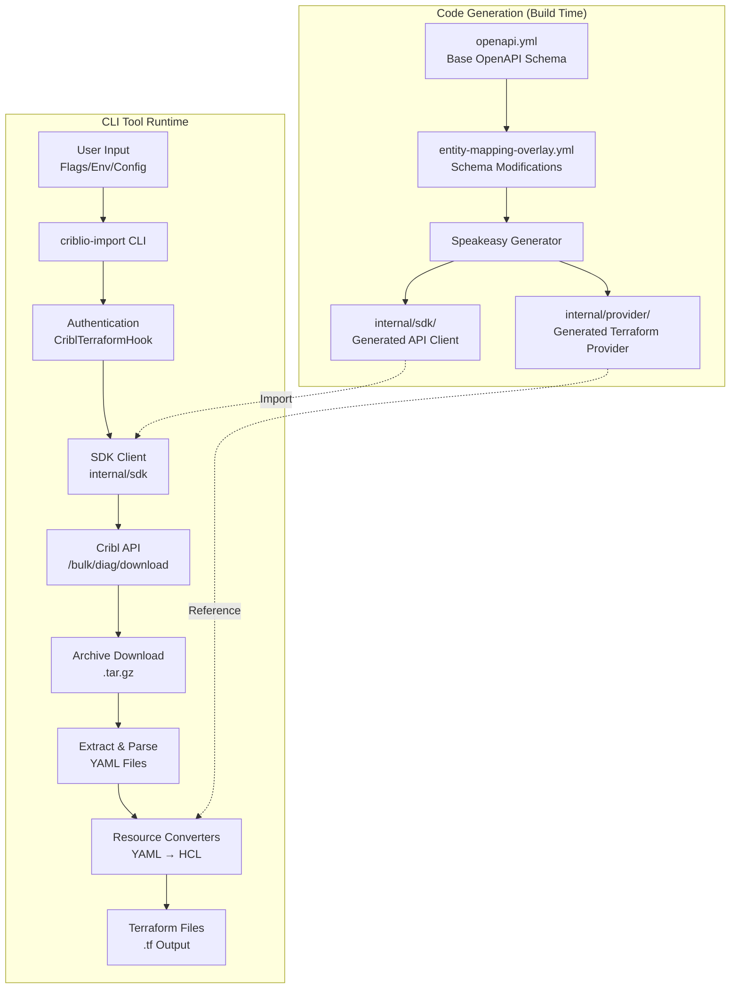

# How to Render Mermaid Diagrams to Images

Since Mermaid diagrams don't render directly in all viewers, here are several ways to convert them to images:

## Option 1: Online Mermaid Editor (Easiest)

1. Go to: https://mermaid.live/
2. Paste the Mermaid code from `DESIGN_FLOW_DIAGRAM.md`
3. Click "Download PNG" or "Download SVG"
4. Save the image

## Option 2: VS Code Extension

1. Install "Markdown Preview Mermaid Support" extension
2. Open `DESIGN_FLOW_DIAGRAM.md` in VS Code
3. Right-click on the diagram → "Export as PNG/SVG"

## Option 3: Command Line (Mermaid CLI)

```bash
# Install Mermaid CLI
npm install -g @mermaid-js/mermaid-cli

# Convert to PNG
mmdc -i DESIGN_FLOW_DIAGRAM.md -o design-flow.png

# Convert to SVG
mmdc -i DESIGN_FLOW_DIAGRAM.md -o design-flow.svg
```

## Option 4: GitHub/GitLab

If you push the markdown file to GitHub or GitLab, Mermaid diagrams render automatically in the web interface.

## Option 5: Use the ASCII Diagram

I've also created `DESIGN_FLOW_VISUAL.txt` which contains a detailed ASCII diagram that can be viewed directly in any text editor or terminal.

## Quick Copy-Paste for Mermaid Live

Here's the first diagram from the document:



Copy this into https://mermaid.live/ to generate an image!

